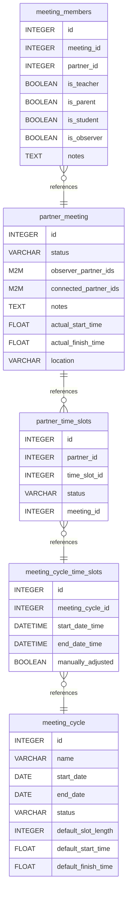

# PTI – Parent Teacher Interviews

## Overview

An Odoo 18 module for managing **Parent-Teacher Interview (PTI)** sessions. It supports the full lifecycle: defining interview cycles, generating time slots, scheduling meetings, and tracking bookings by parents and teachers.

---

## Data Model



---

## Models

### `pti.meeting.cycle`
Represents a scheduled interview period (e.g., "Term 1 2025 PTI").

| Field | Type | Description |
|---|---|---|
| `name` | Char | Cycle name |
| `start_date` | Date | First day of the cycle |
| `end_date` | Date | Last day of the cycle |
| `status` | Selection | `draft` / `active` / `closed` |
| `default_slot_length` | Integer | Length of each slot in minutes |
| `default_start_time` | Float | Day's default start time (float_time) |
| `default_finish_time` | Float | Day's default finish time (float_time) |
| `time_slot_ids` | One2many | Related time slots |

### `pti.meeting.cycle.time.slot`
Individual interview slot within a cycle.

| Field | Type | Description |
|---|---|---|
| `meeting_cycle_id` | Many2one | Parent cycle |
| `start_date_time` | Datetime | Slot start |
| `end_date_time` | Datetime | Slot end |
| `manually_adjusted` | Boolean | Was this slot hand-edited? |

### `pti.partner.meeting`
An actual meeting between a set of partners (teacher + parent ± student).

| Field | Type | Description |
|---|---|---|
| `status` | Selection | `scheduled` / `confirmed` / `in_progress` / `completed` / `cancelled` |
| `connected_partner_ids` | Many2many(`res.partner`) | Teacher / student participants |
| `observer_partner_ids` | Many2many(`res.partner`) | Observers (e.g., school counsellors) |
| `notes` | Text | Free-text notes |
| `actual_start_time` | Float | Actual meeting start (float_time) |
| `actual_finish_time` | Float | Actual meeting finish (float_time) |
| `location` | Char | Room or location name |
| `member_ids` | One2many | Detailed member records |
| `partner_time_slot_ids` | One2many | Booked time slots |

### `pti.meeting.member`
A participant record for a meeting, with role flags.

| Field | Type | Description |
|---|---|---|
| `meeting_id` | Many2one | Parent meeting |
| `partner_id` | Many2one(`res.partner`) | Participant |
| `is_teacher` | Boolean | Role flag |
| `is_parent` | Boolean | Role flag |
| `is_student` | Boolean | Role flag |
| `is_observer` | Boolean | Role flag |
| `notes` | Text | Member-specific notes |

### `pti.partner.time.slot`
A partner's booking against a specific time slot.

| Field | Type | Description |
|---|---|---|
| `partner_id` | Many2one(`res.partner`) | Booked partner |
| `time_slot_id` | Many2one(`pti.meeting.cycle.time.slot`) | Booked slot |
| `status` | Selection | `available` / `booked` / `cancelled` / `completed` |
| `meeting_id` | Many2one(`pti.partner.meeting`) | Associated meeting |

---

## Security Groups

| Group | Technical ID | Access Level |
|---|---|---|
| PTI Manager | `pti_ar.group_pti_manager` | Full CRUD on all PTI models |
| PTI Teacher | `pti_ar.group_pti_teacher` | Read cycles/slots; create/edit meetings |
| PTI Parent | `pti_ar.group_pti_parent` | Read cycles/slots; manage own bookings |

---

## Menu Structure

```
PTI (root)
├── Meetings              (Manager, Teacher)
├── My Bookings           (all roles)
└── Configuration         (Manager only)
    ├── Meeting Cycles
    └── Time Slots
```

---

## Installation

1. Place this module in your Odoo addons path.
2. Update the module list: **Settings → Apps → Update Apps List**.
3. Search for **"PTI"** and install.
4. Assign users to the appropriate PTI security group under **Settings → Users**.

---

## Typical Workflow

1. **Manager** creates a `Meeting Cycle` with a date range and default slot length.
2. **Manager** generates or manually adds `Time Slots` for the cycle.
3. **Teachers** and **Parents** are assigned to `Partner Time Slots` via bookings.
4. A `Partner Meeting` is created to link the slot booking with the actual meeting.
5. `Meeting Members` are recorded with their roles (teacher, parent, student, observer).
6. The meeting moves through statuses: `scheduled → confirmed → in_progress → completed`.

---

## Dependencies

- `base`

## License

LGPL-3
